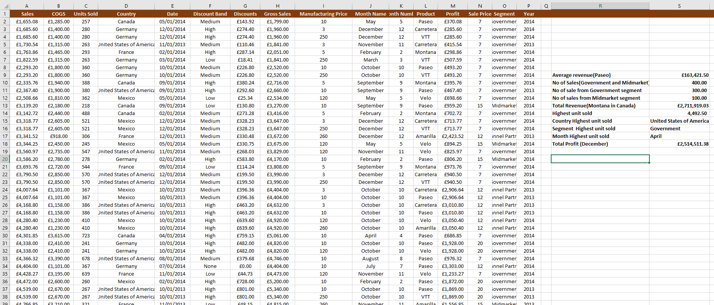
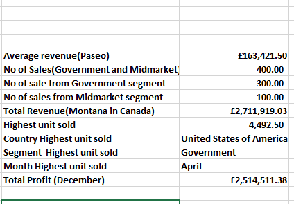
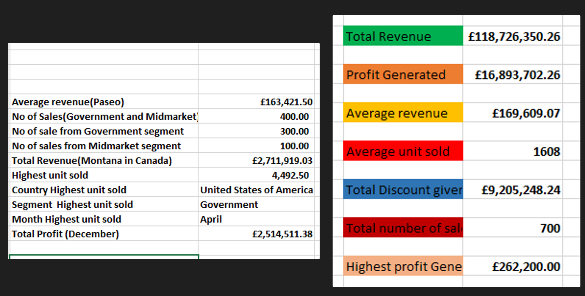

# Advanced-functions
# Application of Advanced functions in Data analysis.

 Advanced Excel functions for data analysis are more sophisticated functions that allow users to perform complex calculations and manipulate data effectively. 
These functions are especially valuable for in-depth data analysis.

# Task   
Using the Sales Data, 
Calculate:
The average revenue generated from each sale of ‘Paseo’
The number of sales made in the Government and Midmarket segment
The total revenue generated from the sales of ‘Montana’ in Canada
In which Country, Segment and Month was the highest unit of goods sold?
What is the total profit made in December?

The underlisted functions were applied to achieve the results for the tasks above.

Average Revenue generated from Paseo =AVERAGEIF(L2:L701, "Paseo",A2:A701)

The Number of Sales made from Government and Midmarket Segment =SUM(COUNTIF(O2:O701,{"government","Midmarket"}))

The total revenue generated from the sales of ‘Montana’ in Canada =SUMIFS(A2:A701,D2:D701,"Canada",L2:L701,"Montana")

The Country highest units is sold =VLOOKUP(S14,C2:D701,2,FALSE)

The Segment that Recorded the highest units of sales =VLOOKUP(S14,C1:O701,13,FALSE)

The month when the Highest Unit of Goods was sold =VLOOKUP(S14,C1:J701,8,FALSE)

The total Profit recorded in December =SUMIF(J1:J701,"December",M2:M701)

From the analysis, I can see that the average revenue from Paseo is £163,421.50 as against Average revenue from all the products standing at ££169,609.07, This means that the sales team should come up with strategies to drive revenue generation from Paseo, as £163,421.50 is below Average.

Out of a total of 700 sales from all segments, Government Segment has 300. This segment should be targetted more than other segments ,while working on improving the number of sales in other segments.

The Total revenue generated in canada from the sales of Montana(considering that the company has 6 products in the market) as compared to the total revenue generated is low and needs urgent improvement.

United state is standing out as the country with the highest units sold. This can be maintained or even surpassed by cross-selling and diversification.

The government Segment is standing out as the segment with the highest unit sold. This is a segment of the market where the company has got some strength and must be maintain this pace and surpass it with more appealing sales strategies.

Further analysis should be carried out to find out why the month of April is recording the highest unit sold, so that more effort can be geared towards a repeat records or surpassing the current record.

The total Profit of £2,514,511.38 generated in december is low, compared to the total profit generated which is £16,893,702.26.

In conclusion, This company is not doing well. It's either an urgent strategy is put in place to increase sales in other countries and segments or they focus on the area of their strenght to maximise revenue and profits.

